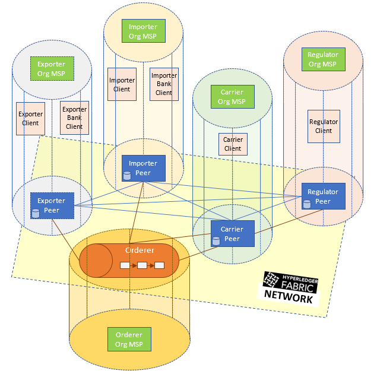
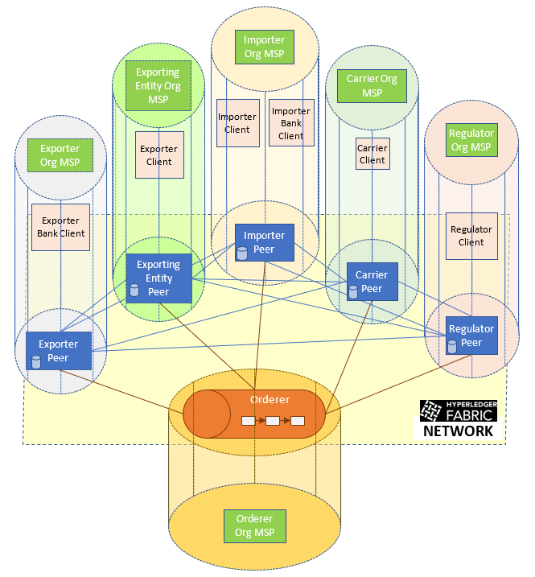

# Configuring and Launching a Trade Network
As described in the [use case document](../docs/Use-Case-Description.docx), we have 6 participants in a trade scenario.   
But since a trading party (exporter or importer) implicitly trusts its bank, the party and the bank can belong to the same organization (run by the bank.)   
The network we configure and run is represented by the figure below, where vertical cylinders represent organizations (with peers and clients), and 
the nodes themselves (peers and orderers) are connected in a blockchain network represented by the horizontal.

- The trade network consists of 4 organizations: {_exporter_, _importer_, _carrier_, _regulator_}
- Every organization has one peer.
- The exporter and importer organizations have two non-admin users each by default (one representing the trading entity and another the bank, 
...whereas the other organizations have one non-admin user each.

# Prerequisites to Configure and Launch the Network
Our application code is based on the current Hyperledger Fabric release version (`release-1.4` branch.)
- Make sure you have `docker` and `docker-compose` tools installed on your system.
- Make sure you have `go` installed on your system.
  * Select a workspace directory where you want to store your go projects
  * Set the `GOPATH` environment variable to that directory
    (e.g. `export GOPATH=$HOME/go`)
- Make sure you are using GNU Tar (For Mac OSX):
  `brew install gnu-tar --with-default-names`
- Download and build [Fabric](https://github.com/hyperledger/fabric/):
  * `mkdir -p $GOPATH/src/github.com/hyperledger`
  * `cd $GOPATH/src/github.com/hyperledger`
  * `git clone https://github.com/hyperledger/fabric/`
  * `cd fabric`
  * If the default branch is not `release-1.4`, append `-b release-1.4` to the above command
  * Run `make configtxgen cryptogen configtxlator` to build the tools we will use to create configuration files.
    * Binaries can be found under `.build/bin`
    * Either move the binaries to a path such as `/usr/local/bin` or add the `$GOPATH/src/github.com/hyperledger/fabric/.build/bin` to the PATH environment variable.
  * Run `make docker` to build docker images for the various network components from the downloaded source code.
- Download and build [Fabric-CA](https://github.com/hyperledger/fabric-ca/):
  * `git clone https://github.com/hyperledger/fabric-ca/` (`release-1.4` branch as above)
  * Run `make docker` to build docker images for the MSP components.

# Configuration
- `configtxgen.yaml`: defines the organization and network structure to generate channel artifacts
- `crypto-config.yaml`: defines the organization users to create keys and certificates for peers and clients
- `base/docker-compose-base.yaml`: defines the shared container specification for every network peer
- `base/docker-compose-base.yaml`: defines the container specifications for the orderer and each network peer
- `docker-compose-e2e-template.yaml`: defines a template for the full network, with container specifications defined for the MSPs, and references to the above file for specifications of the orderer and peers
_Note_: The instructions and the `trade.sh` script, and the code in the [middleware](../middleware/) folders, depend on the currently defined configuration. If you edit the above files, you will need to modify the code accordingly.

# Build Channel and Crypto Artifacts, and Network Structure Using Docker Containers
Run `./trade.sh generate -c tradechannel`   
The following files and folders should be created:
- `channel-artifacts/`: contains files `genesis.block`, `channel.tx`, and 4 anchor peer configuration files, one corresponding to each org
- `crypto-config/`: contains crypto material for the network peers and clients
  * `crypto-config/ordererOrganizations/`: crypto material for the orderer organization
  * `crypto-config/peerOrganizations/`: crypto material for the peer organizations; this should have 4 subfolders, one corresponding to each org
- `docker-compose-e2e.yaml`: network configuration file to launch using the `docker-compose` tool.

# Launch the Network
Run `./trade.sh up`
- By default, this runs the network as a background process, and logs the output to `logs/network.log`.
- To use a different log file, run `./trade.sh up -o <log-file-name>`.
- Alternatively, you can manually start the network as a foreground process: `docker-compose -f docker-compose-e2e.yaml up`.
- You can view the network logs (from all the containers) in the foreground.

** NOTE:** If you are testing the middleware or application deployment, stop here. Middleware and application instructions will indicate when/how to add and start additional organizations.  
  
# Bring Down the Network
Run `./trade.sh down`
- If you ran the full application using instructions in [middleware](../middleware/) and [application](../application/), and if you still uncleared docker containers upon running `docker ps -a`:
  * To clean up the containers, run `docker kill $(docker ps -q)` followed by `docker rm $(docker ps -a -f status=exited -q)`.
    (*Note*: This will remove all docker containers on your system, so if you want to be selective, modify the above commands suitably.)
  * To clean up network volumes, run `docker volume rm $(docker volume ls | grep -v VOL | awk '{print $2}')`.
    (*Note*: This will remove all docker volumes on your system, so if you want to be selective, modify the above command suitably.)

# Add a New Organization
We can add a new organization called _exporting entity_ as illustrated in the figure below.

# Configuration
- `add_org/configtxgen.yaml`: defines the organization and network structure to generate channel configuration
- `add_org/crypto-config.yaml`: defines the organization users to create keys and certificates for peers and clients
- `add_org/docker-compose-exportingEntityOrg-template.yaml`: defines a template for the network structure of the new organization, with container specifications for the MSP and peer
_Note_: The instructions and the `trade.sh` script, and the code in the [middleware](../middleware/) folders, depend on the currently defined configuration. If you edit the above files, you will need to modify the code accordingly.

# Build Channel Configuration, Crypto Artifacts, and Network Structure, for the New Organization
Run `./trade.sh createneworg`   
The following files and folders should be created:
- `channel-artifacts/exportingEntityOrg.json`: contains polices and certificates for the new organization
- `crypto-config/peerOrganizations/exportingentityorg.trade.com/`: contains crypto material for the network peers and clients
- `add_org/docker-compose-exportingEntityOrg.yaml`: network configuration file to launch using the `docker-compose` tool.

# Launch the Network Components of the New Organization
**Note:** if your network has been stopped, first start it using `./trade.sh up`  
Run `./trade.sh startneworg`  
- This runs the network as a background process, and logs the output to `logs/network-neworg.log`.
- Alternatively, you can manually start the network as a foreground process: `docker-compose -f add_org/docker-compose-exportingEntityOrg.yaml up`.
- You can view the network logs (from all the containers) in the foreground.

# Bring Down the Network Components of the New Organization
Run `./trade.sh stopneworg`
- If you ran the upgrade application using instructions in [middleware](../middleware/) and [application](../application/), and you still see uncleared docker containers upon running `docker ps -a`:
  * To clean up the containers, run `docker kill $(docker ps -q)` followed by `docker rm $(docker ps -a -f status=exited -q)`.
    (*Note*: This will remove all docker containers on your system, so if you want to be selective, modify the above commands suitably.)
  * To clean up network volumes, run `docker volume rm $(docker volume ls | grep -v VOL | awk '{print $2}')`.
    (*Note*: This will remove all docker volumes on your system, so if you want to be selective, modify the above command suitably.)
